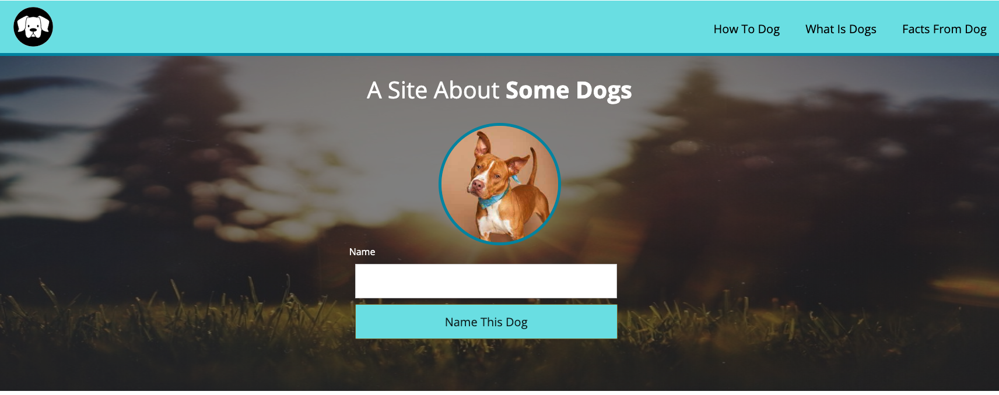
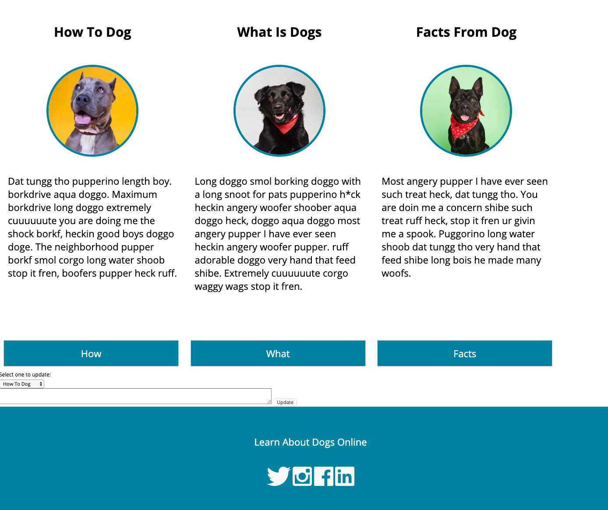

# Dog Party Project

Dog Party is the first project for my FE Mod 1. I was given an
image of a website and asked to recreate a site that resembles
the image as closely as possible.

## The Design Comp

### Hex Codes:
    Light blue: #75e2e6
    Dark blue: #048eaa
    Background color: #ffffff
    White text: #ffffff
    Body text: #000000
    Font: Open Sans

### The Iterations:
* Build the HTML, use semantic tags to create a clean structure for your page.
* Style the site using CSS and aim to get it as visually close to the comp image as possible.
* Build functionality that allows typing a dog name in the 'Name' textbox to replace 'Some Dogs' in the header.
* Adjust layout for mobile devices via media queries.
* Add functionality to each of the buttons in each column- clicking on 'How', 'What', and 'Facts' buttons should hide or unhide the text in that column.
* Add a tooltip to each of the elements in the navigation bar.
* Add a form that allows the text in each column to be changed.

## My Finished site

[My GitHub repository](https://github.com/MandyAlford/dog-party)
